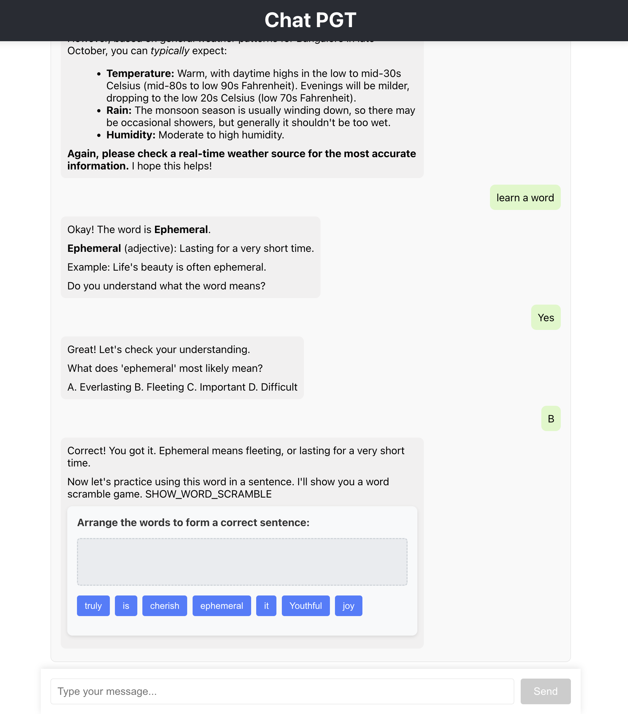

# ChatPGT - Interactive Word Learning App

An interactive chat application that helps users learn new words with comprehension checks and word scramble games.


## Features

- Chat with an AI assistant
- Learn new vocabulary words
- Test comprehension with multiple-choice questions
- Practice with interactive word scramble games

## Setup

### Backend

```bash
cd app_backend
npm install
# Create a .env file with your API_KEY
npm run dev
```

### Frontend

```bash
cd app_frontend/client
npm install
npm start
```

## Technologies

- Backend: Express.js, Google Generative AI (Gemini)
- Frontend: React, Server-Sent Events (SSE)